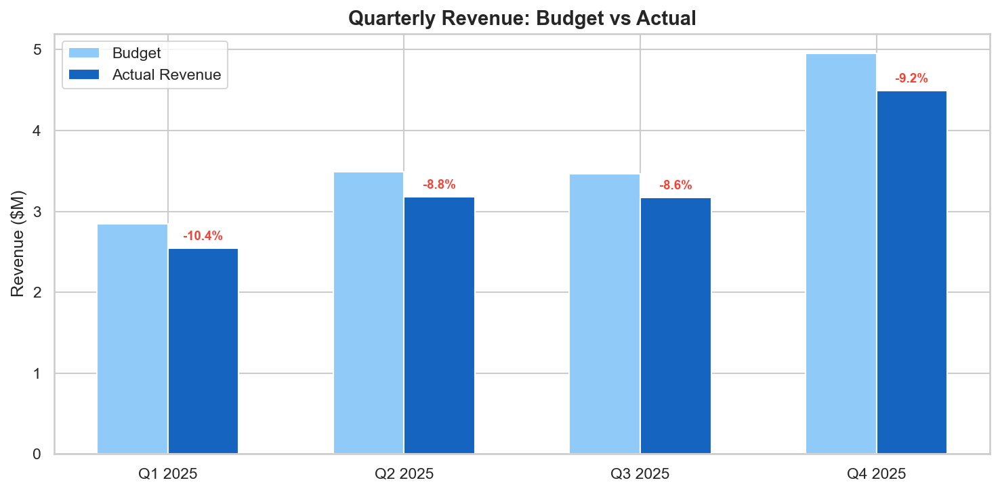
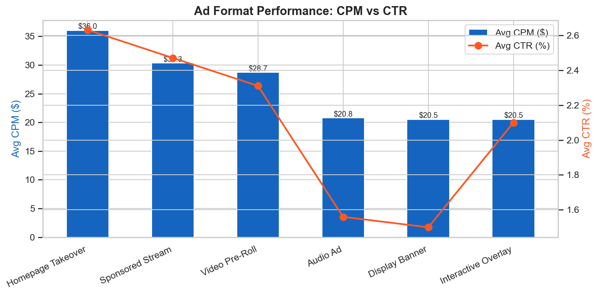
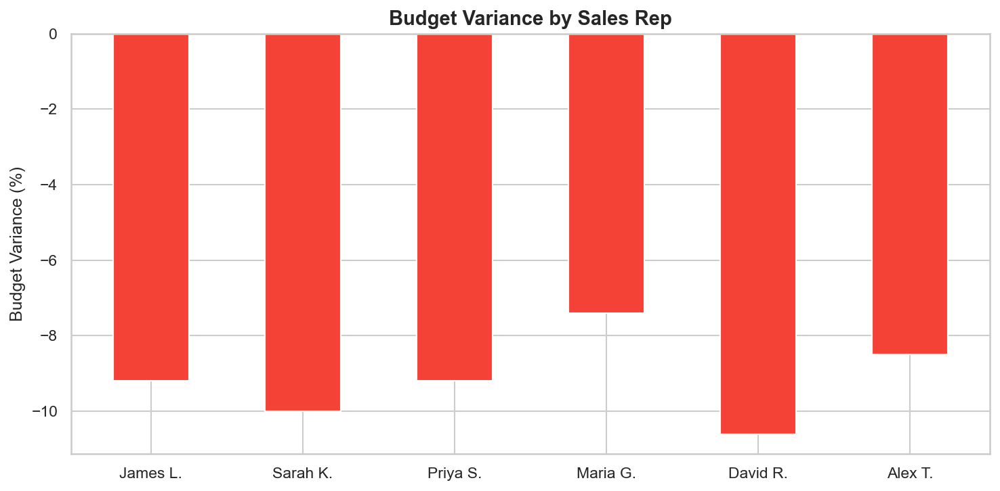
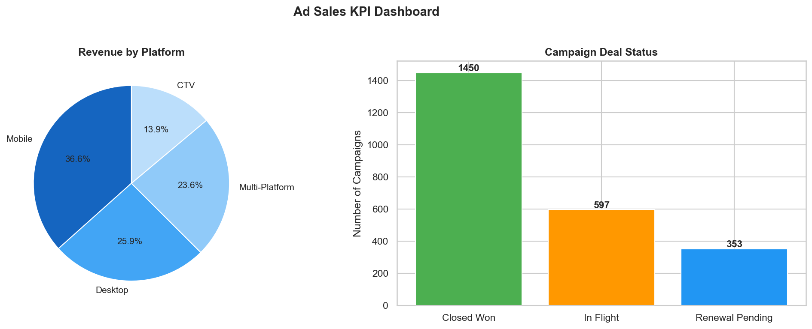
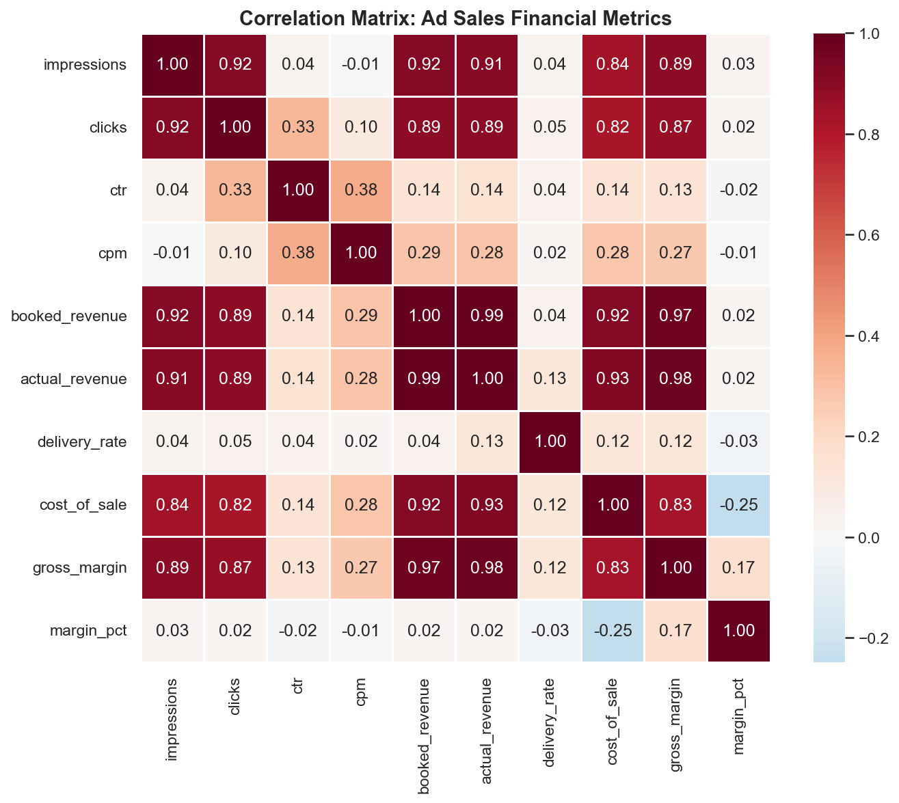

# Ad Sales Revenue Analytics

> End-to-end financial analysis of 2,400 advertising campaigns — hypothesis testing, budget variance modeling, and revenue segmentation across three integrated data sources.


## Business Context

Digital advertising teams manage millions in campaign budgets across multiple platforms and formats. This project simulates a real-world ad sales operation, merging data from three systems (Sales CRM, Ad Platform, Finance) to answer:
- Which ad formats and verticals drive the most revenue?
- Are we hitting budget targets? Where are the biggest variances?
- Which sales reps are outperforming, and what can we learn from them?
- Are there statistically significant differences between campaign segments?

## Dashboards

| | |
|:---:|:---:|
|  |  |
| **Quarterly Budget vs Actual** | **Revenue by Industry & Tier** |
|  |  |
| **Ad Format Performance (CPM vs CTR)** | **Budget Variance by Sales Rep** |
|  |  |
| **Financial KPI Dashboard** | **Correlation Matrix** |

## Key Findings

| Metric | Value | Insight |
|--------|-------|---------|
| Total Revenue | **$13.4M** | Across 2,400 campaigns |
| Avg Gross Margin | **64.9%** | Healthy profitability |
| Top Vertical | **Technology ($4.7M)** | Highest revenue-generating industry |
| Premium Format | **Homepage Takeover ($36.02 CPM)** | Highest-priced inventory |
| Overdue Payments | **11.5%** | Collections process improvement needed |
| Budget Variance | **-9.2%** | Forecasting model refinement opportunity |

## Statistical Methods

| Method | Application | Finding |
|--------|-------------|---------|
| Independent t-test | Premium vs Standard tier revenue | Significant difference (p < 0.05) |
| Pearson Correlation | Revenue vs impressions, clicks, CPM | Strong positive correlations identified |
| Budget Variance Analysis | Quarterly actual vs forecast | Q4 seasonal uplift confirmed |

## Data Sources Simulated

| Source | Fields | Description |
|--------|--------|-------------|
| Sales CRM | advertiser, industry, account_tier, sales_rep | Client and deal info |
| Ad Platform | ad_format, platform, impressions, clicks, CTR, CPM | Campaign performance |
| Finance System | booked_revenue, budget, actual_revenue, cost_of_sale, gross_margin, payment_status | Financial data |

## Project Structure

```
ad-sales-revenue-analytics/
├── data/
│   └── ad_sales_data.csv                # 2,400-row merged dataset
├── scripts/
│   ├── generate_data.py                 # Simulates multi-source ad sales data
│   └── ad_sales_queries.sql             # 7 SQL queries for financial analysis
├── notebooks/
│   └── ad_sales_analysis.py             # Full financial analysis with KPI tracking
├── dashboards/                          # 6 publication-ready visualizations
├── requirements.txt
├── .gitignore
└── README.md
```

## How to Run

```bash
# Clone the repository
git clone https://github.com/behaldeepanshi01-gif/ad-sales-revenue-analytics.git
cd ad-sales-revenue-analytics

# Install dependencies
pip install -r requirements.txt

# Generate data and run analysis
python scripts/generate_data.py
python notebooks/ad_sales_analysis.py
```

## Tools Used

- **Python**: pandas, numpy, matplotlib, seaborn, scipy.stats
- **SQL**: Revenue aggregation, variance analysis, rep performance, collections risk
- **Statistical Methods**: T-tests, Pearson correlation, budget variance analysis

## Author

**Deepanshi Behal** | [LinkedIn](https://linkedin.com/in/bdeepanshi) | [GitHub](https://github.com/behaldeepanshi01-gif)
